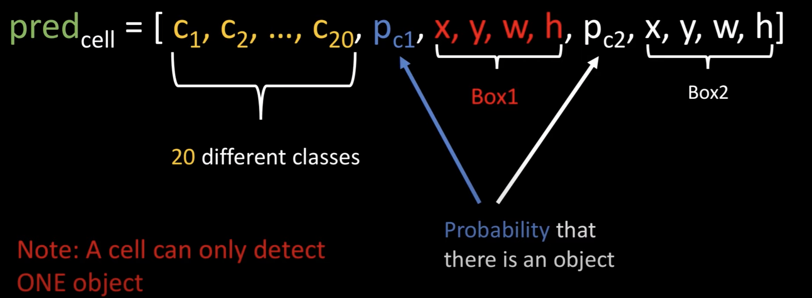
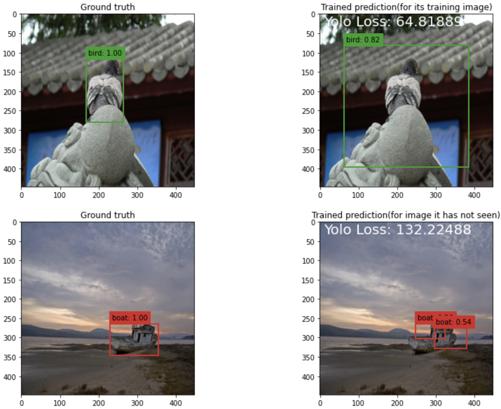

# Weakly-supervised segmentation with boxes
## Yolo_v1_from_scratch

<p align="center">
  
</p>

## Download dataset(5GB) from Kaggle into Google Colab with the following command
```bash
!pip install -q kaggle
from google.colab import files
files.upload()
```
Upload the kaggle.json file, can follow the tutorial if necessary (https://www.kaggle.com/general/74235)
```bash
!mkdir ~/.kaggle
!cp kaggle.json ~/.kaggle/
!chmod 600 ~/.kaggle/kaggle.json
```

```bash
!kaggle datasets download -d aladdinpersson/pascal-voc-dataset-used-in-yolov3-video
```

```bash
!unzip pascal-voc-dataset-used-in-yolov3-video.zip
```

## Architecture of Neural Network
<p align="center">
  
</p>

## Loss Function
The loss function in Yolo is much more complicated than pixel-level segmentation algorithm. Because we need to consider which bounding box to choose, the coordinate, the size, whether it contains an object and the label. 

The structure of prediction can be found as follows, which will be very useful when we develop the loss function.

**Note 1:** x,y here is the midpoint of the bounding box.

**Note 2:** w,h is the ratio of the width and height of the cells. (e.g. when w = 1, the width of the bounding box is the same as the width of the cell.

**Note 3:** w and h can be greater than 1, which means the bounding box can be larger than the cell.

<p align="center">
   
</p>

## Sample Output
<p align="center">
   
</p>

## Reference
1. Most idea from Yolo's paper:
Redmon, J., Divvala, S., Girshick, R., & Farhadi, A. (2016). You only look once: Unified, real-time object detection. In Proceedings of the IEEE conference on computer vision and pattern recognition (pp. 779-788).

2. The code from external library:
https://github.com/aladdinpersson/Machine-Learning-Collection/blob/master/ML/Pytorch/object_detection/YOLO/utils.py

3. Full dataset can be retrieve from https://www.kaggle.com/datasets/aladdinpersson/pascal-voc-dataset-used-in-yolov3-video. The code for uploading the dataset from kaggle to colab can be found in the appendix.
4. Get a better understanding about Yolo after watch the video:
https://www.youtube.com/watch?v=n9_XyCGr-MI&list=PLhhyoLH6Ijfw0TpCTVTNk42NN08H6UvNq&index=6
